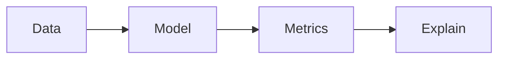

# Component previews

Not the live profile. GitHub only renders `README.md` on [github.com/remi-9](https://github.com/remi-9). Open this file in the editor **Markdown preview** so the SVGs load. They use your public data; first load can take a few seconds.

Rule used here: **at most two visual widgets** plus your existing copy. More than that is the cluttered look everyone scrolls past.

---

## Composed looks (pick one)

Same headline and projects as the current README. Only the visual layer changes.

### A — Skill strip (minimum visual, still clean)

Best default if you want “interesting” without looking generated.

**Jeremias Pablo**

Working toward data science and machine learning. Python is the default: datasets, models, metrics, and whether a prediction can be explained.

The projects below are that loop in practice — applied ML, analytics, and a few products around the edges.

  

Then the current project table + LinkedIn. No stats cards.

Dark GitHub users would get the dark strip instead (`#gh-dark-mode-only` / `#gh-light-mode-only`). Dark variant:

  

---

### B — Copy + compact languages (two column)

Popular layout. One small card, not a widget wall. Languages will skew toward C/HTML from coursework unless we hide those langs — shown honestly first.

<table>
<tr>
<td valign="top" width="50%">

**Jeremias Pablo**

Working toward data science and machine learning. Python is the default: datasets, models, metrics, and whether a prediction can be explained.

The projects below are that loop in practice.

</td>
<td valign="top" width="50%">

</td>
</tr>
</table>

Optional: hide coursework langs with `&hide=c,html,php` so the card matches the DS/ML story:

---

### C — Repo cards instead of the table (most visual, still quiet)

Niche-popular: [github-readme-stats pin cards](https://github.com/anuraghazra/github-readme-stats). Replaces the markdown table. Two-by-two, transparent, no rank chrome.

<table>
<tr>
<td>

</td>
<td>

</td>
</tr>
<tr>
<td>

</td>
<td>

</td>
</tr>
</table>

Keep a one-line caption under each card if GitHub’s repo description is empty (SmishKaBa and JobTracker have no description — those cards will look thin until the repo description is set).

---

### D — Skill strip + one stats card

Popular combo. Stop here; do not add streak or graph on top.

  

---

## Individual components

### Use (low clutter)

**Skill icons** — [skillicons.dev](https://skillicons.dev). One row, six icons. Replaces the `Python · PyTorch · …` text line.

**Compact top langs** — [github-readme-stats](https://github.com/anuraghazra/github-readme-stats). Smallest useful stats widget.

**Repo pin card** — same project, one card. Use as a set (layout C) or not at all.

**Monochrome shields** — [Shields.io](https://shields.io) + [Simple Icons](https://simpleicons.org). Quieter than skill icons; good if you dislike icon tiles.

**LinkedIn as a single badge** (instead of a text link):

**Mermaid loop** — niche, no third-party image, matches the DS/ML headline. GitHub renders it natively.

---

### Optional (one of these, never all)

**Full stats card** — fine alone; skip if you already use langs or pins.

**Streak** — [denvercoder1/github-readme-streak-stats](https://github.com/DenverCoder1/github-readme-streak-stats). Adds a second card for little career signal.

**Activity graph** — [Ashutosh00710/github-readme-activity-graph](https://github.com/Ashutosh00710/github-readme-activity-graph). Distinctive, wide, easy to dominate the page.

**Repos-per-language summary** — [vn7n24fzkq/github-profile-summary-cards](https://github.com/vn7n24fzkq/github-profile-summary-cards). One card is niche and clean; the usual 4-card grid is clutter.

---

### Skip (shown so you can see why)

**Typing SVG** — motion without information.

**Trophies** — [ryo-ma/github-profile-trophy](https://github.com/ryo-ma/github-profile-trophy). Game UI on a hiring profile.

**Visitor counter** — looks like 2013.

**Rainbow `for-the-badge` stack** — loud, repeats the skill-strip job worse.

---

## Pairing guide

| If you pick | Add | Do not also add |
| --- | --- | --- |
| A Skill strip | Optional LinkedIn badge | Stats, streak, graph, trophies |
| B Langs column | Keep the text table | Skill strip *and* stats *and* pins |
| C Repo cards | One-line captions where GitHub descriptions are empty | The markdown table (duplicate) |
| D Strip + stats | Nothing else | Streak, graph, trophies, typing |

Recommended pairing for this profile: **A + keep the table**, or **C** if you want the page to feel designed. Set GitHub descriptions on `SmishKaBa` and `JobTracker` before choosing C.
